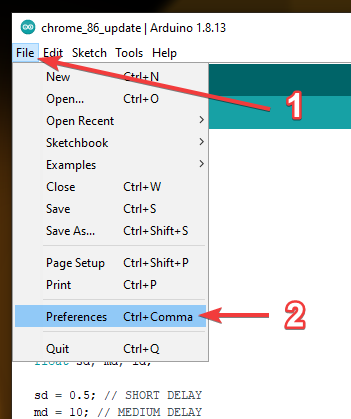
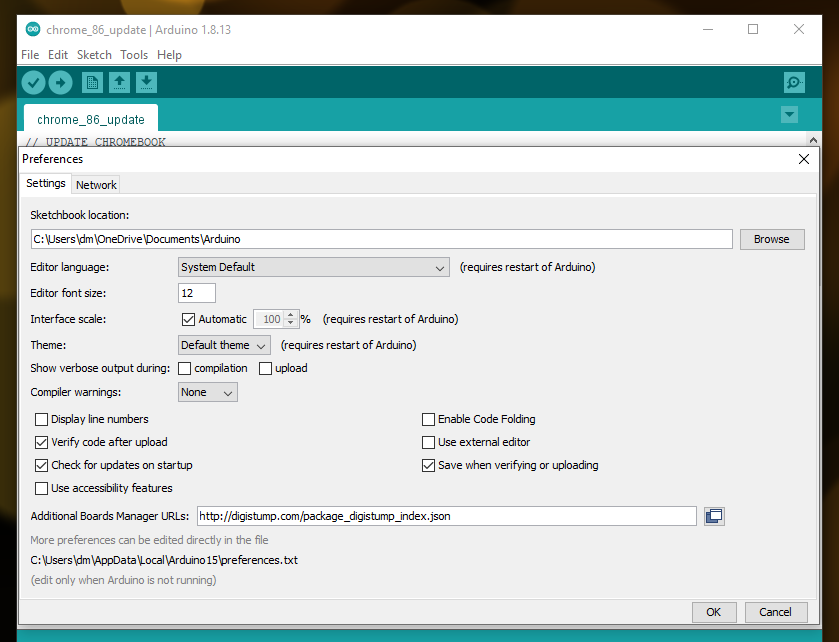
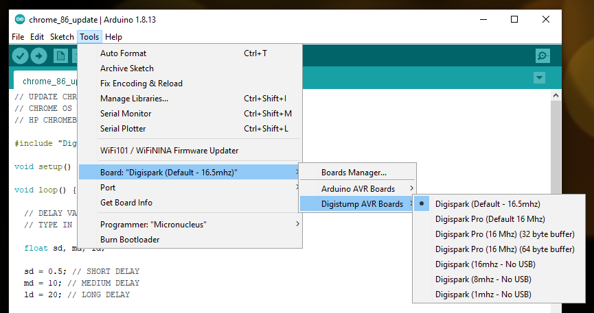
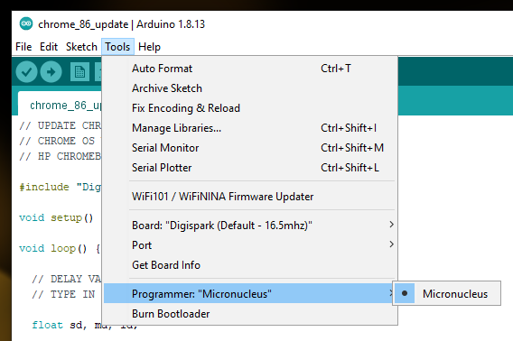

# DigiSpark Chromebook Automation
Tasks to help automate chromebook power washes, enrollment, and updates.

Required Software:

* Arduino IDE 1.8.13 - [Direct](https://www.arduino.cc/en/software)

Required Hardware:

* ATtiny85 General Micro USB Development Board for Arduino - [Amazon](https://www.amazon.com/AiTrip-Digispark-Kickstarter-Attiny85-Development/dp/B0836WXQQR/ref=sr_1_5?dchild=1&keywords=digispark+usb&qid=1619496257&sr=8-5)

# Setting Up Arduino IDE 1.8.13:

1. Download and install Arduino IDE 1.8.13
2. Open Arduino IDE 1.8.13
3. Go to File > Preferences  
4. Next to "Additional Boards Manager URLs:" type the following without quotation marks, "http://digistump.com/package_digistump_index.json"  
5. Click "OK"
6. Go to Tools > Board > Boards Manager
7. In the top left of the Boards Manager window, change the type to "Contributed"
8. Look for "Digistump AVR Boards" and click "Install"  
9. Go to Tools > Board
10. Under "Digistump AVR Boards" select "Digispark (Default - 16.5mhz)"  
11. Go to Tools > Programmer
12. Select "Micronucleus"  
