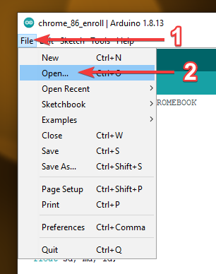
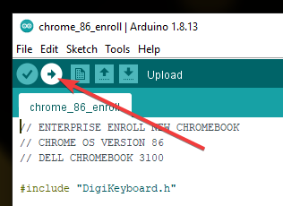

# DigiSpark Chromebook Automation
Tasks to help automate chromebook power washes, enrollment, and updates.

Required Software:

* Arduino IDE 1.8.13 - [Direct](https://www.arduino.cc/en/software)

Required Hardware:

* ATtiny85 General Micro USB Development Board for Arduino - [Amazon](https://www.amazon.com/AiTrip-Digispark-Kickstarter-Attiny85-Development/dp/B0836WXQQR/ref=sr_1_5?dchild=1&keywords=digispark+usb&qid=1619496257&sr=8-5)

Tested Devices:

* Dell Chromebook 3100
* HP Chromebook 14 G4
* HP Chromebook 14 G5

# Setting Up Arduino IDE 1.8.13:

1. Download and install Arduino IDE 1.8.13
2. Open Arduino IDE 1.8.13
3. Go to File > Preferences  
4. Next to "Additional Boards Manager URLs:" type the following without quotation marks, "http://digistump.com/package_digistump_index.json"  
5. Click "OK"
6. Go to Tools > Board > Boards Manager
7. In the top left of the Boards Manager window, change the type to "Contributed"
8. Look for "Digistump AVR Boards" and click "Install"  
9. Go to Tools > Board
10. Under "Digistump AVR Boards" select "Digispark (Default - 16.5mhz)"  
11. Go to Tools > Programmer
12. Select "Micronucleus"  

# Install DigistumpArduino Drivers

1. Download the latest DigistumpArduino drivers from the DigiStump/DigistumpArduino GitHub page: [GitHub](https://github.com/digistump/DigistumpArduino/releases)
 The latest version at the time of writing is 1.6.7  
2. Extract the contents from downloaded zip file using a archive utility like WinRAR or 7Zip. You can use the built in archival tool as well by right clicking the zip files and selecting "Extract all".
3. Open the extracted folder and run "Install Drivers". You will need to run as administrator to install.  
4. Complete the installation process. If you had the Arduino IDE open you will need to restart it for the changes to take effect.

# Update Sketch Code For Chromebook Enrollment

1. Open the enroll sketch file. Arduino sketch files have the extension: .ino  (Example: dell_chromebook_3100/chrome_86_enroll/chrome_86_enroll.ino)
2. Look for the following lines:

		char WIFISSID[] = "YOUR-WIFI-SSID";
		char WIFIPASSWORD[] = "YOUR-WIFI-PASSWORD";
				
		char ENROLLUSERNAME[] = "YOUR-ENROLL-USERNAME";
		char ENROLLPASSWORD[] = "YOUR-ENROLL-PASSWORD";

3. Update the text within the quotations after the variable name. Update wifi SSID and password for adding the wifi network and update enroll username and password for the account to use for enrolling the Chromebooks. Example:

		char WIFISSID[] = "student_wifi";
		char WIFIPASSWORD[] = "1234567890";

		char ENROLLUSERNAME[] = "enroll@your.domain.com";
		char ENROLLPASSWORD[] = "0987654321";

 

4. Save the sketch file.

# Verify And Upload Sketch:
1. Open the sketch file for the task that you want to upload to the DigiSpark USB.  
2. Click "Verify" to check the code for errors. The console will display errors if any. Errors will need to be corrected before proceeding, otherwise the upload process will fail.    
3. Click "Upload" to being the upload process. Once the text in the console says "Plug in device now... (will timeout in 60 seconds)" plug in your DigiSpark USB.    
4. When the console outputs "Micronucleus done. Thank you!" you may remove the DigiSpark USB.  
